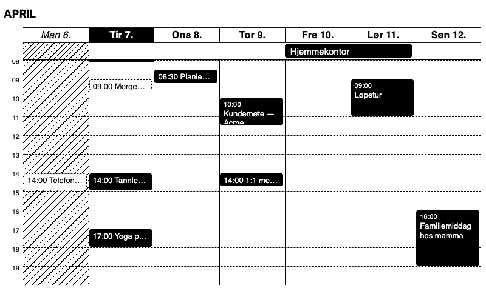

# Google Calendar Week



A full-screen TRMNL-compatible week view for LaraPaper that reads a single Google Calendar from its private iCal feed and renders the current week from Monday to Sunday.

The widget is designed for a self-hosted LaraPaper setup. It does not depend on TRMNL's hosted Google Calendar integration.

## What It Shows

- Current week only, Monday through Sunday
- Norwegian day and month labels
- 24-hour clock
- A washed-out style for days that have already passed
- A top strip for all-day and multi-day events
- A timed grid that always shows `09:00` to `20:00`, and expands when events fall outside that window

## Setup

### 1. Get the Google Calendar secret iCal URL

On a desktop browser:

1. Open Google Calendar.
2. Hover the calendar you want under `My calendars`.
3. Open `Settings and sharing`.
4. Scroll to `Integrate calendar`.
5. Copy the `Secret address in iCal format`.

Use the secret URL, not the public URL. Treat it like a password.

If the secret address is missing, your Google Workspace admin may have disabled export. In that case this widget will need a future OAuth/API-based integration instead.

### 2. Import into LaraPaper

1. Build the widget package:

```bash
cd google-calendar-week
./build.sh
```

2. In LaraPaper, import `google-calendar-week.zip` as a recipe/plugin.
3. Fill in the custom fields:
   - `Google Calendar iCal URL`
   - `Calendar Label` (optional)

LaraPaper will poll the iCal feed and expose the parsed events to the Liquid template as `data.ical`.

## Local Preview

The local preview config includes mock `data.ical` sample events plus a fixed Tuesday timestamp so the preview shows:

- a week crossing from March into April
- washed-out Monday content
- overlapping timed events
- all-day and multi-day events
- early and late events outside the default window

Run preview from this widget directory:

```bash
trmnlp serve
```

## Files

```text
google-calendar-week/
├── .trmnlp.yml
├── build.sh
├── README.md
└── src/
    ├── full.liquid
    └── settings.yml
```

## Notes

- The widget is intentionally full-screen only in v1.
- It is read-only and targets a single Google Calendar.
- The display assumes Norwegian language and `Europe/Oslo` time.
