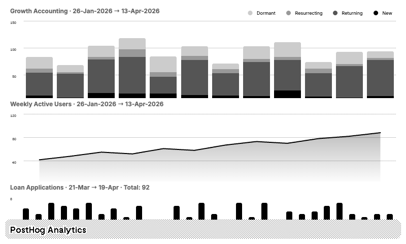

# PostHog Analytics — TRMNL Plugin



A TRMNL e-ink display plugin that shows PostHog analytics:

- **Growth Accounting** — New, returning, resurrecting, and dormant users (weekly, last 90 days)
- **Weekly Active Users** — WAU trend over 3 months
- **Loan Applications** — Daily `loan_application_created` events (last 30 days)

## Project Structure

```
├── .trmnlp.yml              # Local dev config with sample data
├── src/
│   ├── settings.yml          # Plugin definition & custom fields
│   ├── full.liquid           # Full screen (800x480)
│   ├── half_horizontal.liquid
│   ├── half_vertical.liquid
│   ├── quadrant.liquid
│   └── shared.liquid         # Highcharts includes
└── README.md
```

## Setup

### 1. Create saved insights in PostHog

Create three saved insights in your PostHog project:

1. **Lifecycle** — Insight type: Lifecycle, event: `$pageview`, interval: weekly, date range: last 90 days
2. **Weekly Active Users** — Insight type: Trends, event: `$pageview`, math: unique users, interval: weekly, date range: last 90 days
3. **Loan Applications** — Insight type: Trends, event: `loan_application_created`, math: total count, interval: daily, date range: last 30 days

Note the numeric insight ID from each saved insight's URL (e.g. `https://us.posthog.com/project/12345/insights/100` → ID is `100`).

### 2. Create a PostHog personal API key

Go to Settings → Personal API Keys → Create personal API key. The key starts with `phx_`.

### 3. Configure in Larapaper

Create a plugin in your larapaper BYOS and fill in the custom fields:

| Field | Value |
|---|---|
| PostHog API Key | `phx_your_key_here` |
| PostHog Host | `https://us.posthog.com` (or your self-hosted instance) |
| PostHog Project ID | Your project ID |
| Lifecycle Insight ID | ID from step 1 |
| WAU Insight ID | ID from step 1 |
| Loan Insight ID | ID from step 1 |

Import the Liquid templates from `src/` into your plugin.

## Local Development

### Prerequisites

Ruby 3.x with `trmnl_preview` gem: `gem install trmnl_preview`

### Preview with sample data

```bash
trmnlp serve
```

Open http://localhost:4567 to see the plugin rendered with sample data from `.trmnlp.yml`.

## How It Works

The plugin uses TRMNL's multi-URL polling to fetch three saved insights directly from the PostHog API:

1. `GET /api/projects/{id}/insights/{lifecycle_id}/?refresh=true`
2. `GET /api/projects/{id}/insights/{wau_id}/?refresh=true`
3. `GET /api/projects/{id}/insights/{loan_id}/?refresh=true`

Responses are available in templates as `IDX_0`, `IDX_1`, `IDX_2`. Each contains PostHog's standard insight response with a `result` array of series objects.

Charts are rendered with Highcharts, optimized for e-ink (no animation, grayscale colors, high contrast).
