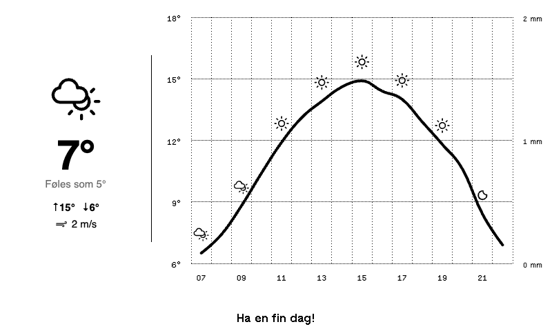

# Yr Vær



Norwegian weather forecast widget for TRMNL e-ink displays, powered by [MET.no Locationforecast](https://api.met.no/weatherapi/locationforecast/2.0/documentation).

## What It Shows

- **Current conditions:** Large weather icon, temperature, "føles som" (wind chill / heat index), daily high/low, wind speed
- **Hourly chart (06–22):** Temperature line, precipitation bars (solid + hatched uncertainty), weather icons every 2 hours
- **Footer:** "Ha en fin dag!" greeting

All text is in Norwegian. Units are Celsius and m/s.

## Project Structure

```text
yr-weather/
├── src/
│   ├── full.liquid          # Main template (HTML + CSS + JS + Highcharts)
│   ├── settings.yml         # Plugin config, polling setup, custom fields
│   └── icons/               # Weather Icons SVGs (wi-* set + layout variants)
│       ├── wi-*.svg          # ~219 weather icon SVGs
│       ├── full/             # Curated icons for full layout
│       ├── half_horizontal/
│       ├── half_vertical/
│       └── quadrant/
├── .trmnlp.yml              # Local preview config with mock data
├── build.sh                 # Packages src/ into yr-weather.zip
└── README.md
```

## Setup

### MET.no API

No API key required. The plugin sets a `User-Agent` header in `settings.yml` as required by MET.no's terms of service.

### Custom Fields

| Field | Default | Description |
|---|---|---|
| `latitude` | `59.91` | Latitude for the forecast location |
| `longitude` | `10.75` | Longitude for the forecast location |

### LaraPaper Import

1. Run `./build.sh` to create `yr-weather.zip`
2. Import the zip into your LaraPaper instance
3. Configure latitude and longitude for your location

## Local Development

```bash
cd yr-weather
trmnlp serve
```

The `.trmnlp.yml` includes mock MET.no data for an April day in Oslo with morning sun, afternoon rain, and evening clearing.

## Data Source

- **Endpoint:** `https://api.met.no/weatherapi/locationforecast/2.0/compact`
- **Refresh interval:** 30 minutes
- **Data used:** Hourly temperature, wind speed, precipitation amount, and weather symbol codes
- **Attribution:** Weather data from [MET Norway](https://www.met.no/) via [Locationforecast API](https://api.met.no/)
